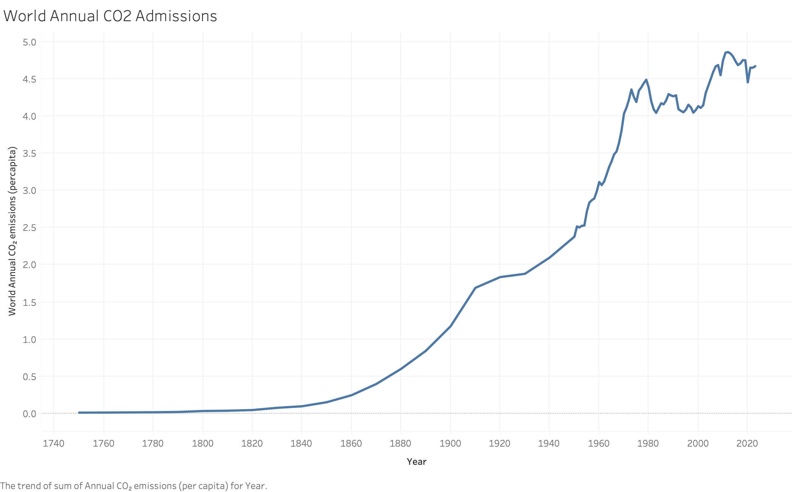
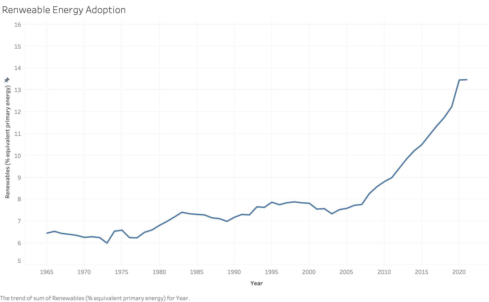
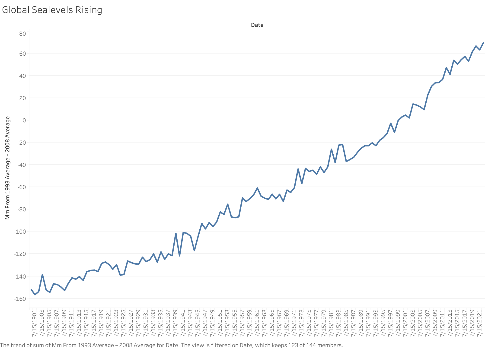
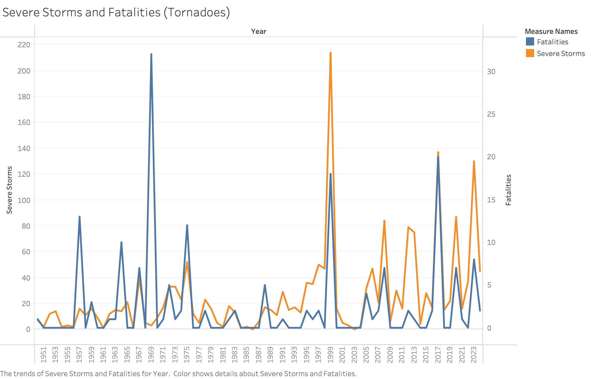
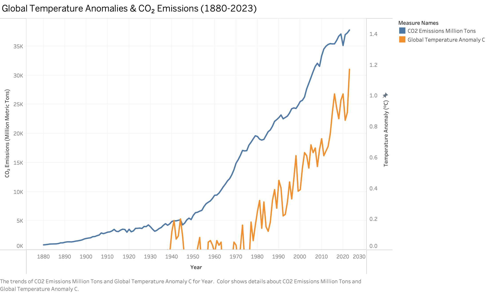
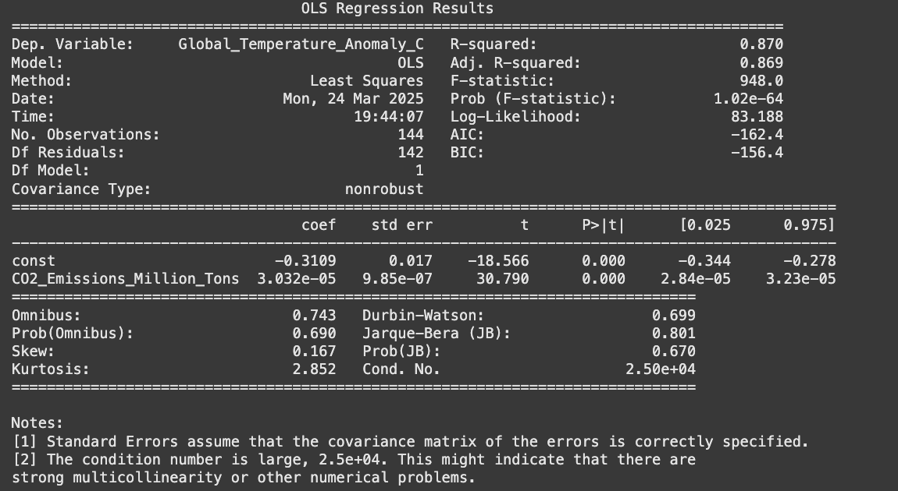

## **Climate Change Impact Analysis Project**

A Data-Driven Approach to Understanding Global Climate Change Trends 

*By: Evan Lewis*

## **Executive Summary**

This project investigates the multifaceted impacts of climate change on global weather patterns, focusing on temperature fluctuations, sea level rise, and the increasing frequency and intensity of extreme weather events. Climate change is one of the most pressing challenges of the 21st century, affecting ecosystems, human health, economic stability, and global security. The urgency to address climate change stems from its widespread consequences, including rising global temperatures, shrinking ice sheets, ocean acidification, and biodiversity loss. These changes not only threaten natural habitats but also have significant implications for agriculture, water resources, and human settlements.

Through comprehensive data analysis, we aim to identify key trends, predict future climate scenarios, and recommend mitigation and adaptation strategies. This project leverages datasets from reputable climate organizations, such as NASA, NOAA, and the Intergovernmental Panel on Climate Change (IPCC), to provide evidence-based insights into the current state of the climate. Our approach integrates statistical analysis with data visualization techniques to uncover critical insights into climate change and its far-reaching effects.

By examining historical climate data and projecting future trends, we seek to understand the drivers of climate change and their impacts on different regions of the world. This analysis will help policymakers, researchers, and the public make informed decisions to reduce greenhouse gas emissions, enhance climate resilience, and promote sustainable development.

Ultimately, our goal is to contribute to global efforts to combat climate change by providing actionable insights and fostering greater awareness of the urgent need for climate action. This project underscores the importance of data-driven decision-making in addressing one of humanity’s most critical challenges.

[Read detailed background information here] [Background.md]()

## Key Performance Indicators (KPIs)

### 1. Global Temperature Anomaly Index (GTAI)
- *Understanding temperature deviations allows for better climate policy decisions, helping to shape mitigation efforts and track global warming trends.*
- **Measures:** Percentage change in average global temperature deviations from historical baselines.
- **Target:** Limit temperature rise to below **1.5°C** above pre-industrial levels.
- **Baseline:** Current increase of approximately **1.1°C**.
- **Frequency:** Monthly updates based on global climate models.

### 2. Sea Level Rise Rate (SLRR)
- **Measures:** The rate of global sea level rise annually.
- **Target:** Stabilize sea level rise through emission reductions.
- **Monitoring:** Annual satellite-based measurements from NOAA and NASA.

### 3. Frequency of Extreme Weather Events (FEWE)
- **Tracks:** The number of extreme weather events (hurricanes, wildfires, floods) per year.
- **Target:** Reduce occurrence through climate resilience measures.
- **Review:** Annual analysis of global event data.

### 4. Carbon Emissions Reduction Rate (CERR)
- **Evaluates:** The annual reduction rate of global CO₂ emissions.
- **Target:** Achieve **net-zero emissions by 2050**.
- **Assessment:** Based on national and international emission reports.

### 5. Renewable Energy Adoption Index (REAI)
- **Measures:** The percentage of global energy consumption from renewable sources.
- **Target:** Reach **50% renewable energy usage globally by 2030**.
- **Tracking:** Annual energy reports from international organizations.

### 6. Additional Indicators for Better Context and Causality
- **Global CO₂ Emissions:** Tracks total global emissions as a primary driver of climate change.
- **GDP and Energy Consumption Correlation:** Examines how economic growth impacts emissions and sustainability efforts.
- **Deforestation Rate:** Measures the annual rate of forest loss, a major factor in carbon sequestration.

These additional indicators provide a more **comprehensive understanding of climate change drivers and their interdependencies**, strengthening our ability to establish causality in climate trends.

## Data Visualizations

### 1. World Annual CO₂ Emissions

The graph above shows the trend of annual CO₂ emissions per capita from 1750 to 2023. The data highlights the rapid increase in emissions since the Industrial Revolution, with a significant acceleration after 1950. This trend reflects the growing global reliance on fossil fuels for energy production, transportation, and industrial activities. The fluctuations in recent years may indicate policy interventions, economic slowdowns, or shifts towards renewable energy sources.

### 2. Renewable Energy Adoption

This graph tracks the percentage of global energy consumption sourced from renewables from 1965 to 2023. The data shows a slow increase in renewable energy adoption until the early 2000s, after which growth accelerated significantly. This trend aligns with global efforts to transition to sustainable energy sources, driven by advancements in technology, government incentives, and growing awareness of climate change. The sharp rise in recent years suggests an increasing commitment to reducing carbon emissions.

### 3. Global Sea Levels Rising

The visualization presents global sea level changes relative to the 1993–2008 average. The steady increase since the early 1900s highlights the impact of climate change, particularly the melting of polar ice caps and thermal expansion of seawater due to rising temperatures. The trend underscores the long-term environmental consequences of global warming, posing risks such as coastal erosion, increased flooding, and habitat loss for marine and coastal communities.

### 4. Severe Storms and Fatalities (Tornadoes)

This graph illustrates the frequency of severe storms (tornadoes) and associated fatalities from 1950 to 2023. The data shows high variability, with spikes in storm activity and fatalities occurring in certain years. While improvements in forecasting and warning systems have reduced fatalities in recent decades, the overall increase in storm frequency may be linked to climate change. The correlation between storm activity and fatalities suggests that preparedness and infrastructure improvements play a crucial role in mitigating disaster impacts.

### 5. Global Temperature Anomalies vs CO₂ Emissions

This graph compares global temperature anomalies with CO₂ emissions from 1880 to 2023. The clear upward trend in both datasets suggests a strong correlation between rising CO₂ levels and increasing global temperatures. While natural climate variability plays a role, the data supports scientific consensus that human-induced emissions are a primary driver of global warming. The accelerated rise in both metrics over the past few decades emphasizes the urgency of emission reduction strategies to curb climate change.

### 6. Regression Analysis: CO₂ Emissions vs. Global Temperatures

This regression analysis explores the relationship between global CO₂ emissions and global temperature anomalies from 1880 to 2023. The model yields an R-squared value of 0.87, indicating that 87% of the variation in temperature anomalies can be explained by CO₂ emissions. The coefficient for CO₂ emissions is both positive and statistically significant (p < 0.001), confirming a strong linear relationship. In other words, as CO₂ emissions rise, global temperatures tend to increase. This supports the broader scientific consensus that human-driven emissions are a key contributor to climate change.